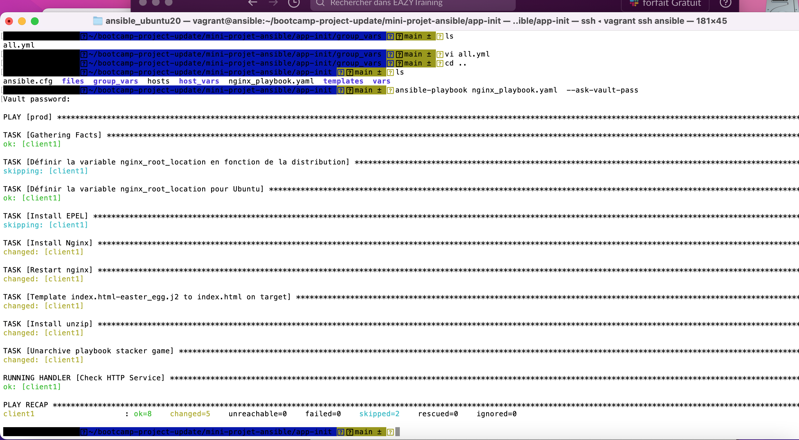
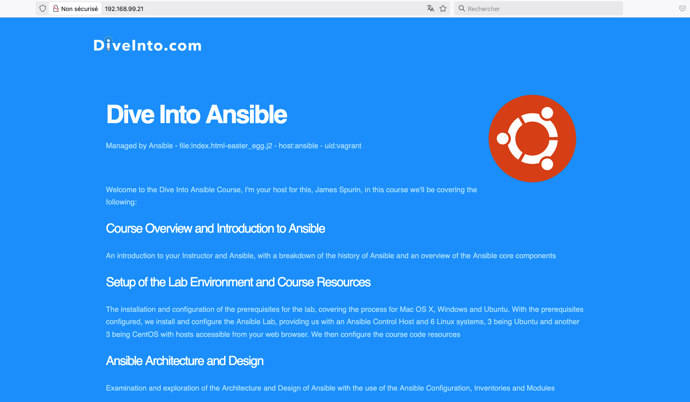
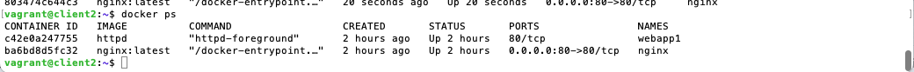
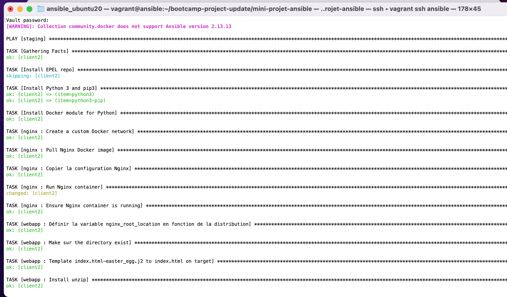

# Mini-Projet Ansible: Déploiement d'une Application

Ce projet consiste en deux étapes pour déployer une application à l'aide d'Ansible : une première étape de déploiement classique et une seconde étape de déploiement en conteneur utilisant Docker, avec le support d'un proxy Nginx en tant que rôle Ansible.

## Prérequis

- **Ansible** installé sur votre machine
- **Docker** installé pour la seconde partie du projet
- Accès à un environnement cible (serveur ou machine virtuelle) où l'application sera déployée

## Partie 1 : Déploiement de l'Application avec un Playbook Simple

### Étapes à suivre

1. **Naviguer dans le répertoire `app-init` du dépôt.**
2. Utiliser le playbook pour déployer l'application du client :
3. Vérifier que l'application est disponible :
   - Utilisez un navigateur web ou une commande curl pour vérifier que l'application est accessible à l'adresse spécifiée.

## Partie 2 : Déploiement de l'Application en Conteneur avec Docker et Nginx en utilisant les rôles ansible

### Étapes à suivre

1. Naviguer dans le répertoire app-template du dépôt.
2. Compléter les fichiers de configuration    
3. Lancer le playbook pour déployer l'application
   ```
   ansible-playbook nginx_webapp_playbook.yaml --ask-vault-pass


### Vérification

Partie 1 : L'application doit être accessible après le déploiement avec un simple playbook.




Partie 2 : L'application doit être accessible via un proxy Nginx dans un conteneur Docker après avoir complété les fichiers et lancé le playbook.
pour des raisons de securité nous avons decidé de ne pas exposer apache à l'exterieur



